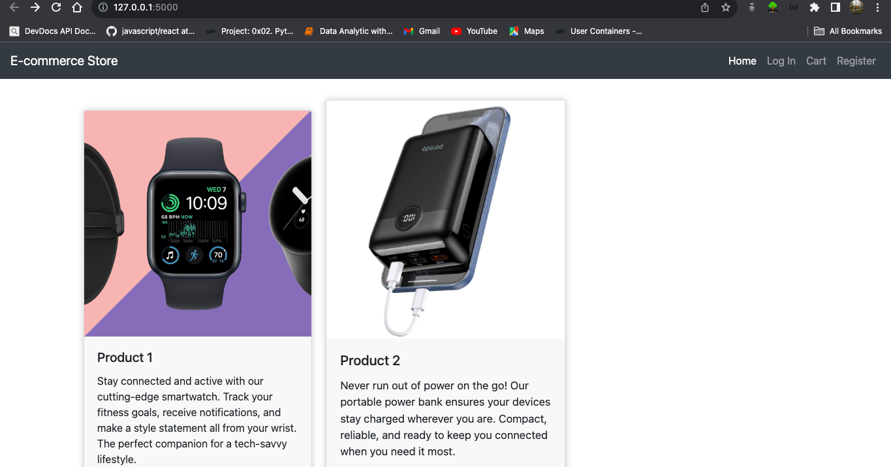

# E-Commerce Web Application



## Table of Contents

- [Description](#description)
- [Features](#features)
- [Installation](#installation)
- [Usage](#usage)
- [Technologies Used](#technologies-used)
- [Contributing](#contributing)
- [License](#license)

## Description

This is an e-commerce web application built using Flask, SQLAlchemy, and other technologies. It allows users to browse products, register, and place orders. Admin users can manage products and orders.

## Features

- User registration and login
- Browse and search for products
- Add products to the shopping cart
- Place and manage orders
- Admin dashboard to manage products and orders
- User and admin authentication and authorization

## Installation

1. Clone the repository:

   ```bash
   git clone https://github.com/mkothm/e-commerce-app.git

   cd e-commerce-app

   pip install -r requirements.txt

   python
>>> from your_app import db
>>> db.create_all()
>>> exit()
  ```


  flask run

  ```
